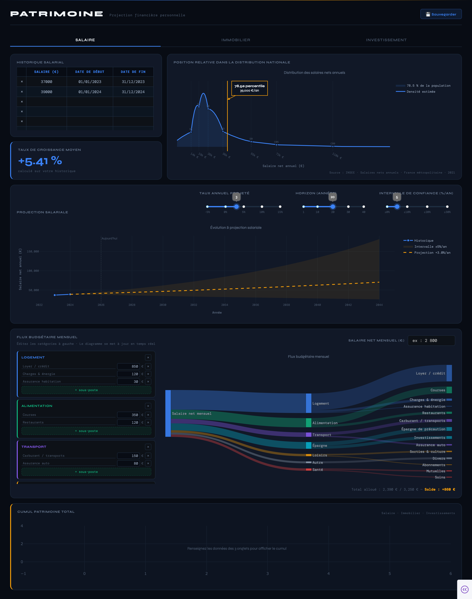
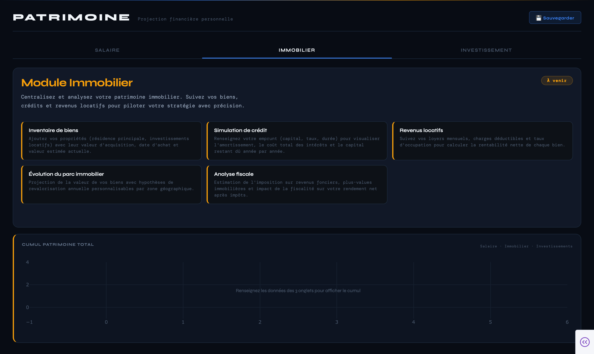
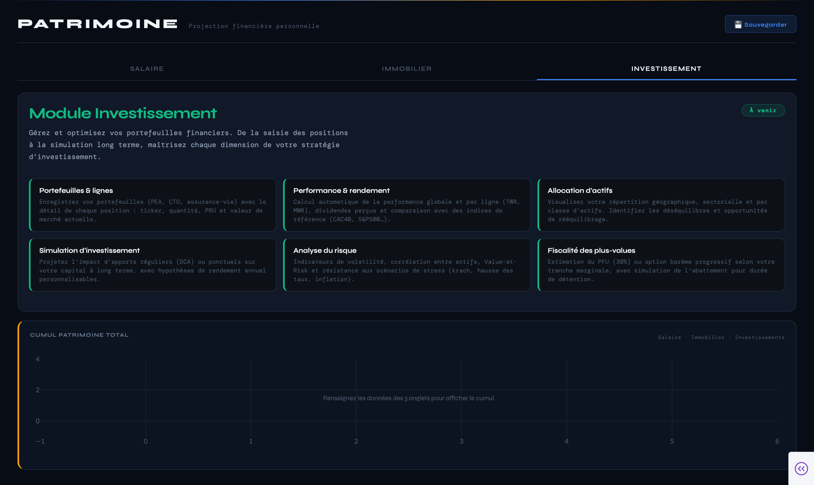

<div align="center">

# Patrimoine — Personal Finance Dashboard - Personnal project

**Un tableau de bord de projection financière personnelle, conçu pour piloter son patrimoine.**

[](https://www.python.org/)
[](https://dash.plotly.com/)
[](LICENSE)
[]()

</div>


## À propos

Il s'agit d'un projet personnel de visualisation et de projection financière, développé en Python avec Plotly Dash.

Il est né d’un besoin simple : disposer d’un espace unique pour centraliser l’analyse de son budget, de son salaire et de leur évolution, sans multiplier les outils ni complexifier inutilement les calculs.

L’objectif n’est pas de proposer une solution universelle, mais de structurer sa propre réflexion financière à travers :
	•	le suivi du budget,
	•	la visualisation de l’évolution du salaire,
	•	la projection à moyen et long terme,
	•	une meilleure compréhension des équilibres personnels.

Ce projet explore donc une approche pragmatique : rassembler dans un même tableau de bord les éléments essentiels à la gestion financière individuelle, afin de faciliter la lecture, la projection et la prise de décision lorsqu’un besoin se présente.

Ce n’est ni un conseil financier ni un outil professionnel, mais un support personnel de compréhension et d’organisation.

> *"Ce n'est pas un outil de trading ni un conseil financier — c'est un tableau de bord pour penser."*


## Interface

### Module Salaire — Vue d'ensemble



## Fonctionnalités actuelles

### Module Salaire

| Fonctionnalité | Description |
|---|---|
| **Historique salarial** | Tableau éditable (date début, fin, montant annuel brut ou net) |
| **CAGR automatique** | Taux de croissance annuel moyen calculé sur l'historique saisi |
| **Distribution INSEE 2021** | Courbe de densité des salaires nets France — percentile du dernier salaire en temps réel |
| **Projection temporelle** | Courbe passé + futur avec taux personnalisable via slider |
| **Intervalle de confiance** | Enveloppe `(taux ± Δ)%` en absolu — s'élargit naturellement par intérêts composés |
| **Flux budgétaire (Sankey)** | Diagramme de flux mensuel catégorisé, valeurs en euros |
| **CRUD budget complet** | Renommer, supprimer, créer catégories et sous-postes à la volée |
| **Persistance JSON** | Sauvegarde locale — rechargement automatique au démarrage et au refresh navigateur |

### Module Immobilier *(à venir)*




### Module Investissement *(à venir)*




## Installation & lancement

### Prérequis

- **Python 3.11+**
- `pip` à jour (`pip install --upgrade pip`)


### macOS / Linux

```bash
# 1. Cloner le dépôt
git clone https://github.com/votre-pseudo/patrimoine.git
cd patrimoine

# 2. Créer et activer un environnement virtuel
python3 -m venv venv
source venv/bin/activate

# 3. Installer les dépendances
pip install -r requirements.txt

# 4. Lancer l'application
python app.py
```


### Windows

```powershell
# 1. Cloner le dépôt
git clone https://github.com/votre-pseudo/patrimoine.git
cd patrimoine

# 2. Créer et activer un environnement virtuel
python -m venv venv
venv\Scripts\activate

# 3. Installer les dépendances
pip install -r requirements.txt

# 4. Lancer l'application
python app.py
```


Ouvrir ensuite **[http://localhost:8050](http://localhost:8050)** dans votre navigateur.

> **Persistance des données**
> Au premier clic sur **Sauvegarder**, un fichier `patrimoine_save.json` est créé dans le répertoire du projet. Il est rechargé automatiquement à chaque démarrage du serveur et à chaque refresh de la page — sans aucune action supplémentaire.


### `requirements.txt`

```
dash>=2.14.0
plotly>=5.18.0
pandas>=2.1.0
numpy>=1.26.0
scipy>=1.11.0
```

## Roadmap

### Module Immobilier
- [ ] Inventaire de biens (résidence principale, investissements locatifs)
- [ ] Simulation de crédit — amortissement, coût total des intérêts, capital restant dû
- [ ] Revenus locatifs et calcul de rentabilité nette par bien
- [ ] Projection de la valeur du parc avec hypothèses de revalorisation annuelle
- [ ] Estimation fiscalité (revenus fonciers, plus-values immobilières)

### Module Investissement
- [ ] Portefeuilles multi-comptes (PEA, CTO, assurance-vie) avec détail des lignes
- [ ] Performance TWR / MWR + dividendes + comparaison indice de référence
- [ ] Allocation d'actifs (classe, secteur, géographie)
- [ ] Simulation DCA et apports ponctuels long terme
- [ ] Indicateurs de risque (volatilité, VaR, corrélation inter-actifs)
- [ ] Fiscalité des plus-values (PFU 30% vs barème progressif)

### Améliorations transversales
- [ ] Bandeau **Cumul patrimoine total** (agrégation des 3 modules)
- [ ] Export PDF du rapport de situation patrimoniale
- [ ] Mode multi-scénarios (comparer différentes hypothèses côte à côte)
- [ ] Import de relevés bancaires CSV pour alimenter le budget automatiquement
- [ ] Thème clair / sombre


## Stack technique

| Composant | Technologie | Rôle |
|---|---|---|
| Framework web | [Plotly Dash](https://dash.plotly.com/) | Application réactive Python |
| Visualisation | [Plotly](https://plotly.com/python/) | Graphiques interactifs (Scatter, Sankey) |
| Manipulation données | [Pandas](https://pandas.pydata.org/) + [NumPy](https://numpy.org/) | Traitement des séries temporelles |
| Interpolation | [SciPy PCHIP](https://scipy.org/) | Courbe de distribution salariale lissée |
| Persistance | JSON local | Sauvegarde légère sans base de données |
| Typographie | Syne + DM Mono | Google Fonts — identité visuelle |


## Licence

Distribué sous licence **MIT**. Voir [`LICENSE`](LICENSE) pour plus d'informations.


<div align="center">

*Les données affichées (distribution INSEE, etc.) sont utilisées à titre indicatif uniquement.*
*Ce projet ne constitue pas un conseil financier ou d'investissement.*

</div>
